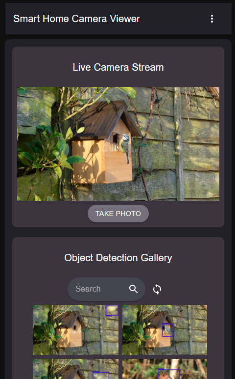

# Raspberry Pi Smart Home Camera App
A React app that connects locally to your Raspberry Pi with camera and lets you view the live camera stream and object detection gallery. Automatically takes and saves pictures to the gallery when objects are detected in the camera view (people, pets, animals, cars, etc). 

Can be used indoors or right outside the home for surveilance or for autonomous photography.

## List of Current Features
### Frontend Client-Side Application
- View the live camera stream from the Raspberry Pi and the object detection images as they are uploaded
- Use the searchbar to search for photos of specific objects in the object detection gallery
- Option to take pictures manually of the content currently shown on the camera stream and download the photo to your device

- View the object detection gallery photos with and without the object bounding boxes
- Able to fully navigate the gallery from the enlarged image view using left and right arrows (pages automatically flip)

- Mobile view:

- Can edit settings such as the confidence threshold required to snap photos of objects

### Backend Flask Server for Raspberry Pi with Camera
- Streams camera content to app (works with many types of cameras)
- Runs object detection algorithm to autonomously take and save pictures whenever an object is in frame
- Allows editing of object detection settings
